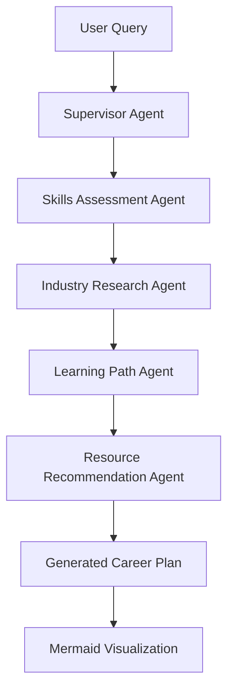

# CareerPath.AI 🚀

An opensource **LLM-driven career planning tool** that generates personalized, interactive roadmaps via chat. Built with a **LangGraph-based multi-agent system** simulating mentors to recommend skills and resources using RAG, embeddings, and prompt engineering. Features **React Flow** visualization for real-time career path mapping.


## ✨ Features

- 🤖 **Multi-Agent System**: Specialized AI agents for different aspects of career planning
- 💬 **Interactive Chat**: Natural conversation interface for career guidance  
- 📊 **Visual Roadmaps**: Dynamic React Flow diagrams showing career progression
- 🎯 **Skills Analysis**: Identify gaps and strengths in your skill set
- 📈 **Industry Insights**: Market trends and salary expectations
- 🛤️ **Learning Paths**: Step-by-step roadmaps with timelines
- 📚 **Resource Recommendations**: Courses, certifications, and learning materials
- 🔍 **Real-time Web Search**: Live search for current courses and certifications with clickable links

## 🏗️ Architecture

### Multi-Agent System (LangGraph)
- **Supervisor Agent**: Orchestrates the workflow and coordinates other agents
- **Skills Assessment Agent**: Analyzes current skills and identifies gaps
- **Industry Research Agent**: Provides market insights and trends
- **Learning Path Agent**: Creates personalized roadmaps with React Flow visualization
- **Resource Recommendation Agent**: Real-time web search for courses and materials with clickable links

### Tech Stack
- **Backend**: FastAPI + LangGraph + OpenAI GPT-4o-mini
- **Frontend**: React + React Flow + Mermaid + Tailwind CSS
- **Visualization**: Mermaid diagrams for career roadmaps
- **Communication**: Real-time chat interface with AI agents

## 🚀 Quick Start (2-Hour POC Setup)

### Prerequisites
- Python 3.8+
- Node.js 16+
- OpenAI API Key
- Tavily API Key (for web search) - Get free at [tavily.com](https://tavily.com/)

### 1. Clone & Setup Environment

```bash
git clone <your-repo>
cd CareerPath.AI

# Set up your API keys
export OPENAI_API_KEY=your_openai_api_key_here
export TAVILY_API_KEY=your_tavily_api_key_here

# Or create a .env file:
echo "OPENAI_API_KEY=your_openai_api_key_here" > .env
echo "TAVILY_API_KEY=your_tavily_api_key_here" >> .env
```

### 2. Backend Setup (FastAPI + Multi-Agent System)

```bash
# Install Python dependencies
pip install -r requirements.txt

# Run the backend
python run_backend.py
```

The backend will start at `http://localhost:8000`

### 3. Frontend Setup (React + Visualization)

```bash
# Navigate to frontend directory
cd frontend

# Install dependencies
npm install

# Start React development server
npm start
```

The frontend will start at `http://localhost:3000`

## 🎯 Usage

1. **Open the application** at `http://localhost:3000`
2. **Start a conversation** with the AI career assistant
3. **Try example queries**:
   - "I want to transition from software engineer to senior software engineer"
   - "Help me become a data scientist from a business analyst role"
   - "What skills do I need to become a product manager?"

4. **Watch the magic happen**:
   - Multiple AI agents collaborate to analyze your request
   - Skills gaps are identified and industry research is performed
   - A visual career roadmap is generated with Mermaid
   - Specific resources and learning materials are recommended

## 🧠 Multi-Agent Workflow



## 📖 API Documentation

Once the backend is running, visit:
- **API Docs**: `http://localhost:8000/docs`
- **Health Check**: `http://localhost:8000/api/health`

### Key Endpoints

- `POST /api/chat` - Simple chat interface
- `POST /api/career-plan` - Full career planning with all agents
- `GET /api/health` - System health and agent status

## 🎨 Screenshots

### Chat Interface
- Clean, modern chat UI with real-time AI responses
- Multi-agent status indicators
- Typing indicators and loading states

### Career Roadmap Visualization  
- Dynamic Mermaid diagrams
- Interactive career path mapping
- Skills progression timeline

## 🛠️ Development

### Project Structure
```
CareerPath.AI/
├── backend/                 # FastAPI backend
│   ├── agents/             # Multi-agent system
│   │   ├── supervisor.py   # Supervisor agent
│   │   ├── skills_agent.py # Skills assessment
│   │   ├── industry_agent.py # Industry research
│   │   ├── learning_agent.py # Learning paths
│   │   └── resources_agent.py # Resource recommendations
│   ├── models/             # Pydantic models
│   └── main.py            # FastAPI app
├── frontend/               # React frontend
│   ├── src/
│   │   ├── components/    # React components
│   │   ├── services/      # API services
│   │   └── App.js        # Main app
│   └── public/
├── requirements.txt       # Python dependencies
└── run_backend.py        # Backend runner script
```

### Adding New Agents

1. Create a new agent class in `backend/agents/`
2. Implement the `__call__` method with LangGraph Command pattern
3. Add the agent to the workflow in `career_graph.py`
4. Update the supervisor to handle the new agent

## 🔧 Configuration

### Environment Variables
- `OPENAI_API_KEY` - Your OpenAI API key (required)
- `TAVILY_API_KEY` - Your Tavily API key for web search (required)
- `PORT` - Backend port (default: 8000)
- `DEBUG` - Enable debug mode (default: True)

### Customizing Agents
Each agent can be customized by modifying their system prompts and logic:
- Adjust response formats in agent classes
- Modify Mermaid diagram generation in `learning_agent.py`
- Update resource recommendations in `resources_agent.py`

## 🚨 Troubleshooting

### Backend Issues
- **"OpenAI API key not set"**: Make sure `OPENAI_API_KEY` is in your environment
- **"Module not found"**: Run `pip install -r requirements.txt`
- **Port conflicts**: Change the port in `backend/main.py`

### Frontend Issues  
- **Backend connection failed**: Ensure backend is running on port 8000
- **Dependencies issues**: Delete `node_modules` and run `npm install`
- **Mermaid rendering issues**: Check browser console for JavaScript errors

## 🎯 POC Demonstration

This POC demonstrates:
1. ✅ **Multi-agent architecture** with LangGraph
2. ✅ **Real-time chat interface** with AI
3. ✅ **Dynamic visualization** with Mermaid
4. ✅ **Skills gap analysis** and career planning
5. ✅ **Industry insights** and resource recommendations
6. ✅ **Clean, modern UI** with React and Tailwind

## 🚀 Next Steps (Beyond POC)

- [ ] Add RAG (Retrieval Augmented Generation) for better recommendations
- [ ] Implement user authentication and profile persistence  
- [ ] Add React Flow for interactive roadmap editing
- [ ] Include real-time job market data integration
- [ ] Add export functionality for career plans
- [ ] Implement more specialized agents (networking, salary negotiation, etc.)

## 📜 License

This project is open source and available under the MIT License.

---

**Built with ❤️ using LangGraph, FastAPI, and React**
